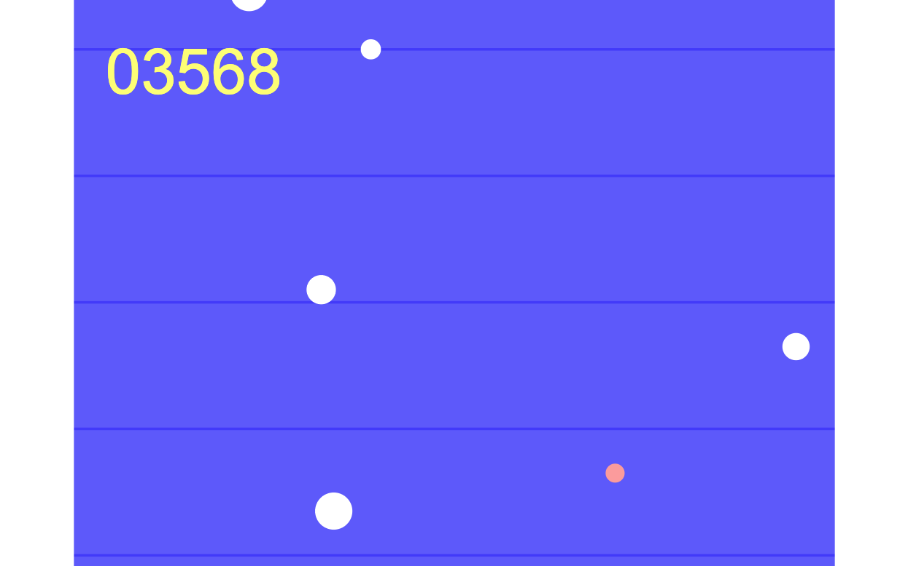

### Oscillator Game
Obstacle-avoiding game built with HTML5 Canvas and Typescript
- Responds to frame lag within bounds
- Responds to canvas resize
- Scale-independent game coordinate system
- Game area and game-safe area for optimum use of screen space
